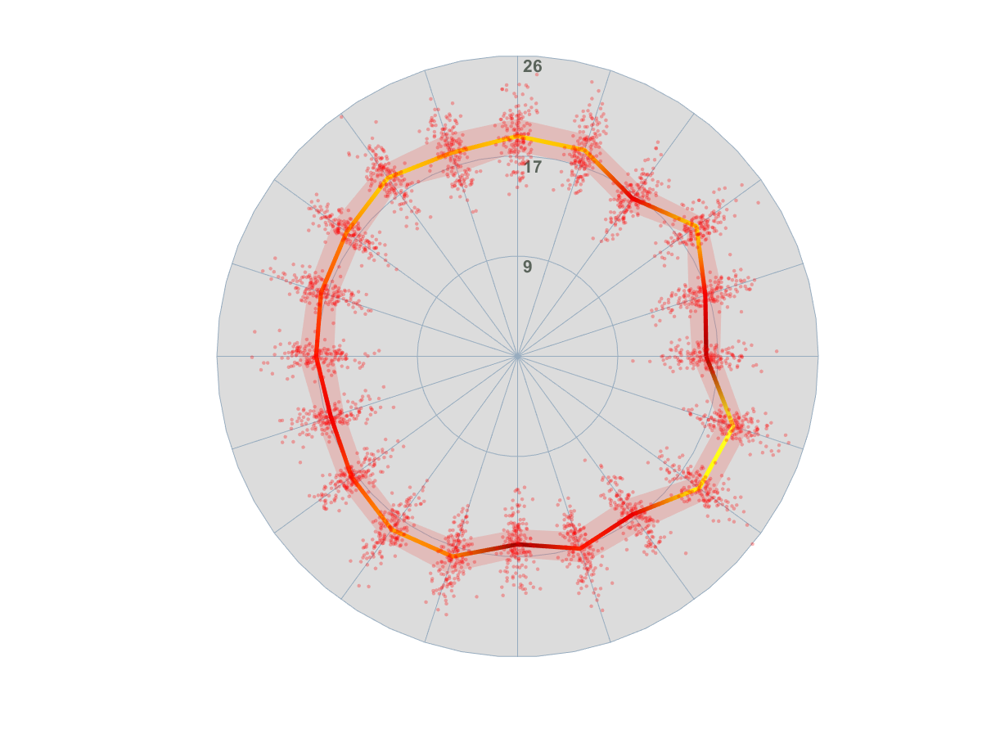

# Spider-Plot
Function for radial distributed data visualization in MATLAB

Also available at https://es.mathworks.com/matlabcentral/fileexchange/75176-spider-plot

Moving beyond mean values, this function allows for a better data understanding by plotting:
- Central tendency (mean or median) enhanced by a colormap 
- Dispersion (Interval defined by percentiles)
- Raw data points 

